# Hyperplane MLAT System

End-to-end multilateration stack for live aircraft tracking.

## What This Repo Runs

1. Go buyer (`main.go`) connects to 4DSky sellers over `neuron/ADSB/0.0.2`.
2. Parsed observations are emitted as JSON (stdout fallback or Kafka mode).
3. Python pipeline (`python/mlat/pipeline.py`) routes messages (CPR vs MLAT path).
4. FastAPI server (`api/server.py`) broadcasts fixes on `/ws/tracks` and serves `/health`.
5. React + Cesium frontend (`web/`) renders aircraft tracks and sidebar stats.

Data path:

```text
4DSky sellers -> Go buyer -> Python pipeline -> FastAPI WebSocket -> React/Cesium globe
```

## MLAT Pipeline Sequence

```mermaid
sequenceDiagram
	participant SN as Sensor Node
	participant DI as Data Ingestion Service
	participant CB as Correlation Buffer
	participant ML as MLAT Solver
	participant AT as Aircraft Tracker
	participant AD as Anomaly Detector
	participant TP as Trajectory Predictor
	participant DC as Downstream Consumers

	SN->>SN: Broadcast Mode-S messages (raw radio signals)

	SN->>DI: Parse and normalize messages (Python, pyModeS, numpy)
	DI->>DI: Attach sensor metadata (antenna, timestamp, ID)
	DI->>CB: Forward normalized observations

	rect rgb(40, 40, 40)
		Note over CB: For each unique message
		CB->>CB: Group observations by message payload and time window
		CB->>CB: Deduplicate by sensor and payload
		CB->>CB: Wait until minimum sensors threshold is met (configurable)
	end

	rect rgb(40, 40, 40)
		Note over CB,ML: Sufficient sensors
		CB->>ML: Provide grouped observations (with ECEF positions, TDOA vectors)

		rect rgb(50, 50, 50)
			ML->>ML: Estimate aircraft position using Levenberg-Marquardt (scipy) or Gradient Descent (PyTorch)
			ML->>ML: Validate solution (Kalman Filter - altitude, altitude, geographic bounds)
			ML->>AT: Emit resolved aircraft position (lat/lon/alt, methods=MLAT)
		end

		Note over CB: Insufficient sensors
		CB->>CB: Discard or buffer incomplete group
	end

	AT->>AT: Maintain per-aircraft state (history, lat/lon, velocity)
	AT->>AT: Smooth positions using Kalman Filter (filterpy, numpy)
	AT->>AT: Provide initial guess for future MLAT solutions (network centroid or last known)

	rect rgb(40, 40, 40)
		Note over AT,AD: Parallel ML threads
		AT->>AD: Send TDOA vectors for anomaly detection
		AD->>AD: Run autoencoder (PyTorch) to detect outliers in TDOA patterns
		AD->>AT: Flag anomalous observations for review or exclusion
	end

	AT->>TP: Provide recent ECEF position history
	TP->>TP: Predict next position using LSTM (PyTorch)
	TP->>AT: Return predicted position for short-term extrapolation

	AT->>DC: Emit smoothed and predicted positions (JSON, API, Kafka/Redis/node)
	DC->>DC: Visualize, store, or further process aircraft tracks

	Note over SN: Hardware: SDR, Raspberry Pi, GPS
	Note over DI: Python, pyModeS, numpy, asyncio
	Note over CB: Python, custom logic
	Note over ML: scipy, PyTorch, numpy
	Note over AT: filterpy (Kalman), numpy
	Note over AD: PyTorch (autoencoder)
	Note over TP: PyTorch (LSTM)
	Note over DC: FastAPI, Kafka/Redis/node & cloud storage
```



## Project Layout

```text
api/                 FastAPI app + shared asyncio queue
internal/            Go ingestion modules (overrides, parser, publisher, stream)
python/mlat/         Routing, CPR, correlation, solver, tracker, ML modules
python/tests/        Unit + integration + runtime resilience tests
web/                 React 19 + Vite + Tailwind + Cesium frontend
scripts/script.sh    Buyer + API supervisor script (stdin pipe via FIFO)
systemd/hyperplane.service
```

## Prerequisites

- Go `1.24+`
- Python `3.11+`
- `uv` (Python package manager)
- Node.js `20+`
- `pnpm`
- `.buyer-env` and `location-override.json` at repository root

## One-Time Setup

```bash
# from repo root
go mod tidy

uv sync --project python

pnpm --dir web install --frozen-lockfile
pnpm --dir web build
```

## Run Locally

### Option A: Fixture Replay (deterministic)

```bash
MLAT_READ_STDIN=1 uv run --project python python -m uvicorn api.server:app --host 0.0.0.0 --port 8000 < python/tests/fixtures/sample_observations.json
```

Open:

- `http://localhost:8000`
- `http://localhost:8000/health`

Important: this input is finite. Once EOF is reached, fixes stop. Aircraft will:

- turn stale/gray in the UI after `30s` (`VITE_AIRCRAFT_STALE_MS`, default `30000`)
- be removed by backend after `120s` (`MLAT_STALE_AIRCRAFT_SECONDS`, default `120`)

### Option B: Live Buyer + Pipeline + API

```bash
go build -o main_app .
chmod +x scripts/script.sh
APP_DIR="$(pwd)" bash scripts/script.sh
```

Then open `http://localhost:8000`.

## Run Tests

```bash
# Go
go test ./internal/... -v

# Python
uv run --project python pytest python/tests -v

# Frontend type/build check
pnpm --dir web build
```

## Phase 8 — ML training, capture, and live checkpoints

Phase 8 adds **JSONL capture**, **offline trainers**, **solver benchmarking**, and optional **live** loading of checkpoints via the Python `Pipeline`:

| Step | What it does |
|------|----------------|
| **8.1 Capture** | `python -m mlat.training.collect_data --fixes-out data/fixes.jsonl --groups-out data/mlat_groups.jsonl < observations.jsonl` — append one JSON object per line for fixes and for correlated MLAT groups (pre-solve). |
| **8.2 Anomaly** | After capture, `python -m mlat.training.train_anomaly --groups-jsonl data/mlat_groups.jsonl` — trains the TDOA autoencoder on successful scipy solves, writes `checkpoints/anomaly_detector.pt` and `reports/anomaly_reconstruction.png`. |
| **8.3 Trajectory** | `python -m mlat.training.train_trajectory --fixes-jsonl data/fixes.jsonl` — trains the LSTM and writes `checkpoints/trajectory_predictor.pt`. |
| **8.4 Solvers** | `python -m mlat.training.compare_solvers --groups-jsonl data/mlat_groups.jsonl --limit 100` — timing and residual summary JSON under `reports/`. |

**Live integration (optional):** pass `anomaly_checkpoint_path` / `trajectory_checkpoint_path` to `Pipeline`, or when using stdin ingest with the API, set `MLAT_ANOMALY_CHECKPOINT` and/or `MLAT_TRAJECTORY_CHECKPOINT` (paths to `.pt` files). See `python/mlat/pipeline.py` for `anomaly_threshold_override` and `prediction_stale_seconds`.

## Environment Variables

Go ingestion:

- `LOCATION_OVERRIDE_FILE` (default: `location-override.json`)
- `PUBLISH_MODE` (`kafka` or `stdout`, default: `kafka`, with stdout fallback if Kafka unavailable)
- `KAFKA_BROKERS` (comma-separated; optional)
- `KAFKA_TOPIC` (default: `modes-observations`)

FastAPI / pipeline runtime:

- `MLAT_READ_STDIN=1` to enable in-process stdin ingest in `api.server`
- `MLAT_ANOMALY_CHECKPOINT` — optional path to `anomaly_detector.pt` (TDOA autoencoder)
- `MLAT_TRAJECTORY_CHECKPOINT` — optional path to `trajectory_predictor.pt` (LSTM gap-fill)
- `MLAT_STALE_AIRCRAFT_SECONDS` (default: `120`)
- `MLAT_STALE_SWEEP_INTERVAL_SECONDS` (default: `5`)

Frontend:

- `VITE_AIRCRAFT_STALE_MS` (default: `30000`)

## EC2 (systemd) Runtime

The current production service is `hyperplane.service` and it runs `scripts/script.sh`.

```bash
# on EC2
cd ~/hyperplane
go build -o main_app .
chmod +x scripts/script.sh

sudo cp systemd/hyperplane.service /etc/systemd/system/hyperplane.service
sudo systemctl daemon-reload
sudo systemctl enable hyperplane
sudo systemctl restart hyperplane

sudo systemctl status hyperplane --no-pager
sudo journalctl -u hyperplane -f
```

Open `http://<EC2_PUBLIC_IP>:8000` after allowing TCP 8000 in the security group.

## Troubleshooting

### Aircraft turn gray and then disappear

Cause: no new fixes are arriving.

Checks:

1. See if stdin ended (`MLAT stdin ingest stopped (EOF reached)` in logs).
2. Confirm `/health` `fixes_per_minute` is non-zero while the source is running.
3. Use a continuous stream (live buyer) instead of one-shot fixture redirection.

Temporary tuning for demos:

```bash
MLAT_STALE_AIRCRAFT_SECONDS=600 VITE_AIRCRAFT_STALE_MS=120000 ...
```

### UI loads but no aircraft appear

1. Verify backend is healthy: `curl http://localhost:8000/health`
2. Verify WebSocket is connected in sidebar status.
3. Confirm incoming observations include decodable ADS-B position frames and/or valid MLAT groups.

